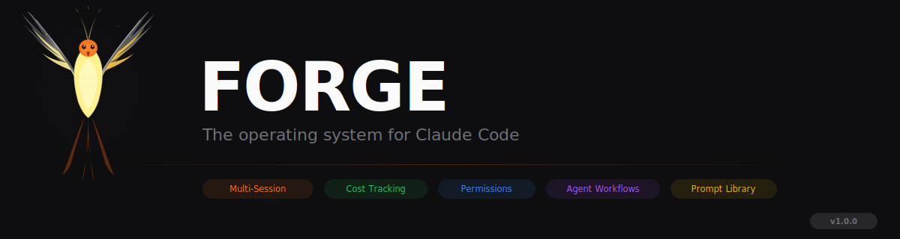
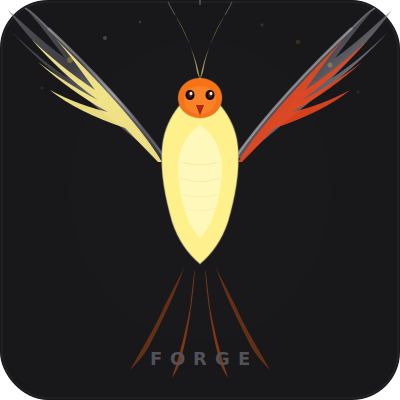

<p align="center">
  
</p>

<p align="center">
  
  
  
  
  
</p>

<p align="center">
  <strong>The operating system for Claude Code.</strong>
</p>

<p align="center">
  Claude Code is the most powerful coding agent in the world. But it runs in a terminal.<br/>
  No visibility. No control. No orchestration. You're flying blind at $75/M output tokens.<br/><br/>
  <strong>Forge changes that.</strong> It's a local-first control plane that sits on top of Claude Code<br/>
  and gives you the infrastructure to run AI-powered development at scale — from one interface.
</p>

<p align="center">
  <a href="#-get-started">Get Started</a> ·
  <a href="#-why-forge">Why Forge</a> ·
  <a href="#-what-you-get">What You Get</a> ·
  <a href="#-how-it-works">How It Works</a> ·
  <a href="#-roadmap">Roadmap</a>
</p>

---

## 🔥 Why Forge

Claude Code is incredible. But using it professionally means:

- **You can't see what it's doing** across multiple sessions. You switch terminals, lose context, miss things.
- **You can't control costs.** One runaway session burns $50 before you notice. Multiply that across a team.
- **You can't orchestrate.** Running Frontend + Backend + Tests agents in parallel? Copy-paste prompts across terminals. Manually.
- **You can't approve safely.** Permission prompts interrupt your flow. You either auto-approve everything (dangerous) or babysit every tool call.
- **You can't learn from history.** What worked? What failed? What cost the most? There's no record.

Forge solves all of this. It hooks directly into Claude Code's internals — session logs, tool calls, the hook system — and gives you a real-time control plane with full visibility, cost tracking, permission management, and multi-session orchestration.

**No cloud. No accounts. No API keys to Forge. Everything runs on your machine.**

---

## 🚀 Get Started

```bash
git clone https://github.com/IsmailQayyum/forge.git
cd forge && npm install
npx vite build
node server/index.js --serve
```

Then connect your Claude Code:

```bash
node src/cli/install.js       # project hooks
node src/cli/install.js -g    # global hooks
```

Open **http://localhost:3333**. That's it.

---

## ⚡ What You Get

### Parallel Session Orchestration

Run multiple Claude Code sessions side-by-side. Frontend agent fixing CSS while Backend agent writes API endpoints while Test agent generates coverage — all visible on one screen.

- **Tab-based sessions** — spawn, switch, rename, kill. Like browser tabs for Claude.
- **Split-screen grid** — 2x2, 3x2, or any layout. All terminals live and interactive.
- **Project auto-detection** — Forge scans your filesystem for `.git` and `CLAUDE.md` projects. Click to launch.
- **Full PTY terminal** — not a simulation. Real xterm.js backed by node-pty. Every Claude feature works.

### Visual Agent Workflows

Design multi-agent systems visually. Like n8n for AI agents. Drag agents onto a canvas, connect them with triggers and actions, define roles and capabilities, then execute — Forge handles the orchestration.

- **Visual canvas** — React Flow powered. Supervisors, workers, reviewers, delegation chains.
- **Capability controls** — per-agent: what tools they can use, what files they can touch.
- **One-click execution** — run the entire pipeline. Agents execute in topological order with output passed downstream.
- **Live activity bubbles** — see what each agent is doing in real-time, right on the canvas nodes.
- **Run summary** — when a pipeline completes, get an overlay with agent results, duration, and exportable reports.
- **Git diff tracking** — Forge captures HEAD before and after a run so you can see exactly what changed.
- **Pre-built templates** — Full-Stack Sprint, PR Review Pipeline, Bug Hunt, Deploy Pipeline.
- **One-click CLAUDE.md export** — your architecture becomes executable instructions.

### Real-Time Cost Intelligence

Every token is tracked. Every dollar is accounted for.

- **Live burn rate** — tokens/min, projected cost, cache hit ratio per session
- **Budget controls** — daily limits with visual progress. Know when you're approaching the edge.
- **Per-project breakdown** — which codebases are eating your budget. 30-day trend chart.
- **Historical tracking** — today, this week, this month, all time. Exportable.
- **Auto-recording** — costs tracked automatically from session token usage events.

### Visual Permission Control

Claude Code's permission system is powerful but invisible. Forge makes it visual.

- **Allow / Deny from the UI** — tool calls surface with full context. Read the command before approving.
- **Activity panel** — every tool call, every file read, every bash command — streaming in real-time.
- **Webhook alerts** — get Slack/Discord notifications when a session needs your approval. Step away from the desk.
- **Fail-open safety** — if Forge goes down, Claude Code keeps working. No single point of failure.

### Command Palette

VS Code-style launcher. Hit **Ctrl+K** from anywhere.

- **Fuzzy search** — find any view, action, or command instantly.
- **Keyboard-first** — arrow keys to navigate, Enter to execute, Escape to close.
- **Full keyboard shortcuts** — Ctrl+1-5 for views, Ctrl+N for new terminal, ? for help.

### Prompt Engineering at Scale

Stop rewriting the same prompts. Build a library. Track what works.

- **10 built-in prompts** — security review, test generation, PR review, refactoring, and more.
- **Custom prompts** — build your own with categories, tags, and variables.
- **One-click launch** — any prompt spawns a Claude session instantly.
- **Usage analytics** — which prompts get used, how often, by which projects.

### Full Integration Layer

Pull context from the tools your team already uses.

- **GitHub** — browse repos, issues, and PRs. Inject as session context.
- **Linear** — fetch tickets and inject them. Claude works on your actual backlog.
- **Slack / Discord / Webhooks** — real-time notifications. Session ended. Permission needed. Error occurred.
- **File parsing** — drag Excel, CSV, PDF, code files. Forge parses and injects them.

### Home Dashboard

Your mission control. See everything at a glance.

- **Stats row** — active sessions, today's cost, workflows, terminals.
- **Quick actions** — one-click to launch terminal, design workflow, browse prompts.
- **Recent activity** — last 5 sessions with status and timing.
- **Active workflows** — see which agent pipelines are running.

---

## ⚙️ How It Works

```
┌─────────────┐    JSONL logs     ┌──────────────┐    WebSocket     ┌─────────────┐
│             │ ────────────────▶ │              │ ◀────────────▶  │             │
│ Claude Code │                   │ Forge Server │                  │  Forge UI   │
│  (terminal) │ ◀── hook bridge ─▶│  (Express)   │                  │  (React)    │
│             │   HTTP POST/GET   │              │                  │             │
└─────────────┘                   └──────────────┘                  └─────────────┘
```

Forge doesn't wrap or replace Claude Code. It **instruments** it:

1. **Session logs** — watches `~/.claude/projects/` in real-time. Every message, tool call, and token count is parsed the instant it's written.

2. **Hook bridge** — a zero-dependency Python script that installs into Claude Code's native hook system. It intercepts tool calls for permission control and enables bidirectional messaging.

3. **Embedded terminal** — spawns Claude Code as a child process via `node-pty`. Full PTY with xterm.js rendering over WebSocket. You're not watching a replay — you're driving.

4. **Agent runner** — executes multi-agent pipelines using `claude -p` in topological order. Parent output is passed to children. Live activity broadcast via WebSocket.

5. **Permission flow** — `PreToolUse` hooks POST to Forge. The UI renders Allow/Deny. The hook polls for your decision. 5-minute timeout. If Forge is unreachable, Claude keeps going (fail-open).

---

## 🛠 Tech Stack

| | Technology |
|---|-----------|
| **Frontend** | React 18 · Vite · Tailwind CSS · Zustand · React Flow · xterm.js |
| **Backend** | Express · WebSocket (ws) · node-pty · chokidar |
| **Integrations** | Octokit · Linear SDK · Slack/Discord webhooks |
| **Persistence** | Local JSON files in `~/.claude/forge/` |
| **Hook bridge** | Python 3 stdlib — zero dependencies |

---

## 🗺 Roadmap

Forge is under active development. Here's where we're headed:

- [ ] **Session replay** — rewind any Claude session step-by-step. See every decision, every file change.
- [ ] **Cost guards** — auto-kill sessions that exceed a budget. Hard limits, not just tracking.
- [ ] **Automated pipelines** — "on every git push, run this Claude prompt." CI/CD for AI.
- [ ] **Session memory** — persist what Claude learned across sessions. Context that survives restarts.
- [ ] **Agent marketplace** — community-shared agent architectures. Import with one click.
- [ ] **Team mode** — shared dashboards, prompt libraries, and cost tracking across a team.
- [ ] **`npx forge`** — one-command install. Zero config.
- [ ] **VS Code extension** — Forge as a sidebar panel.

---

## 🧑‍💻 Development

```bash
git clone https://github.com/IsmailQayyum/forge.git
cd forge && npm install

# Terminal 1 — frontend with HMR
npm run dev

# Terminal 2 — backend
node server/index.js
```

### Production

```bash
npx vite build && node server/index.js --serve
```

---

## 💾 Data & Privacy

Everything stays on your machine. Forge has no cloud, no telemetry, no accounts.

| Data | Location |
|------|----------|
| Session logs | `~/.claude/projects/` |
| Architectures | `~/.claude/forge/architectures.json` |
| Prompts | `~/.claude/forge/prompts.json` |
| Cost history | `~/.claude/forge/cost-history.json` |
| Agent registry | `~/.claude/forge/registry.json` |
| Webhooks | `~/.claude/forge/notifications.json` |

---

<p align="center">
  <strong>Built for developers who take Claude Code seriously.</strong>
</p>

<p align="center">
  
</p>
